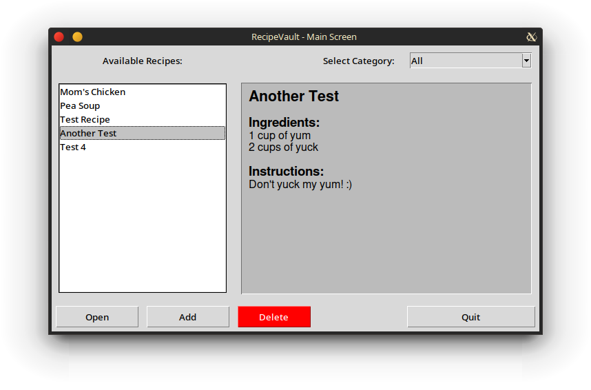
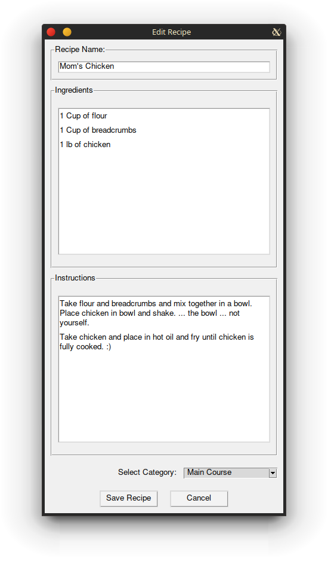

# RecipeVault

This is a project written in Python using the tkinter toolkit
to store and retrieve recipes.

The main screen shows all available recipes. You can add new recipes or open an existing one.
You can also delete that horrible recipe that you got from your neighbor.

## Configuration
The `config.json` contains the following configurable variables:

- `recipe_directory` Sets the location to save and read the recipe text files
- `categories`       A list to set the categories for the recipes
- `bg_color`         Sets the global background color of the application
- `font`             Sets the global font for normal text
- `font_title`       Sets the global font for title text
- `font_subtitle`    Sets the global font for subtitle text
- `preview_color`    Sets the background color of the preview window
- `bt_color`         Sets the global button color of the application
- `bt_font`          Sets the font for buttons
- `button_width`     Sets the width of the buttons

## Usage
On the main screen you'll be greeted with the list of available recipes on the left and a preview
pane on the right. Double clicking a recipe in the left box will open the recipe in the right pane.
You can easily scroll through your recipes from the same screen. If you need to filter through your
recipes. You can use the Select Category drop down box. This allows you to see only recipes for within
that category.
### Enter a new recipe
To add a new recipe, simply click the "Add" button. This will bring up a new window where you can enter
the recipe's name, give it a category, enter the ingredients, and give instructions. After you are
finished, click "Save Recipe".
### Editing a recipe
To edit a recipe, simply click on the recipe and click "Open". This will bring up the edit window where
you can edit every entry of the recipe. 

**NOTE:** Recipes are sorted and saved by their name. Therefore, if
you change the name, it in effect creates another recipe. This can be useful if you are wanting to copy
a recipe and tweak it. However if you are only wanting to change the name, you will need to delete the
one with the old name.
### Deleting a recipe
To delete a recipe, simply click on the recipe and click the big red button labeled "Delete".
